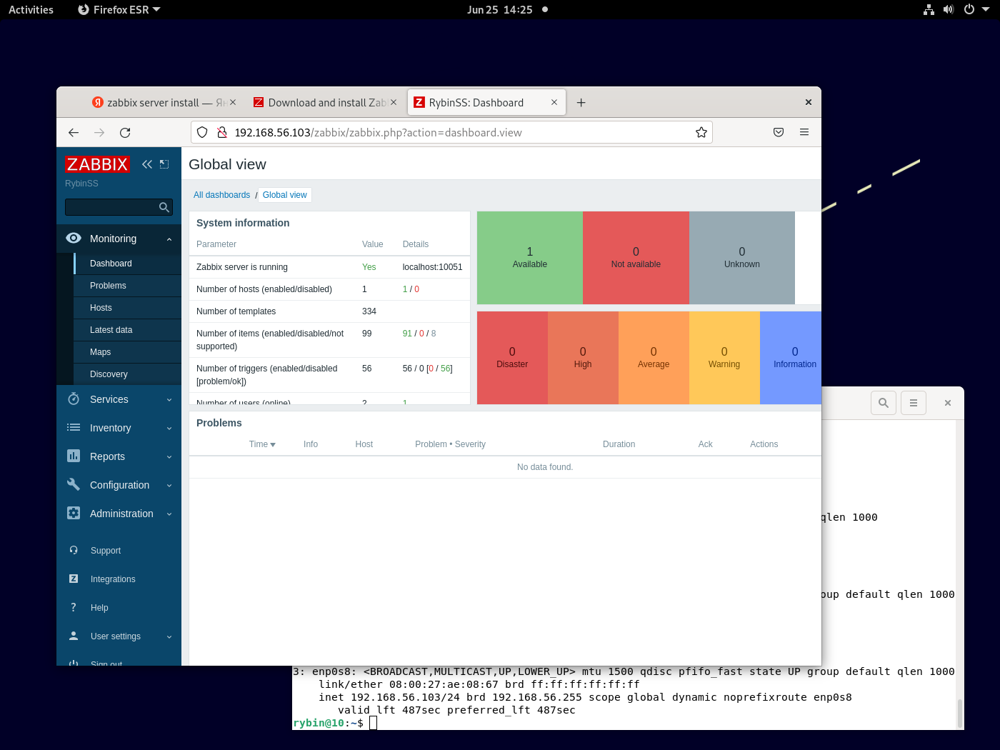
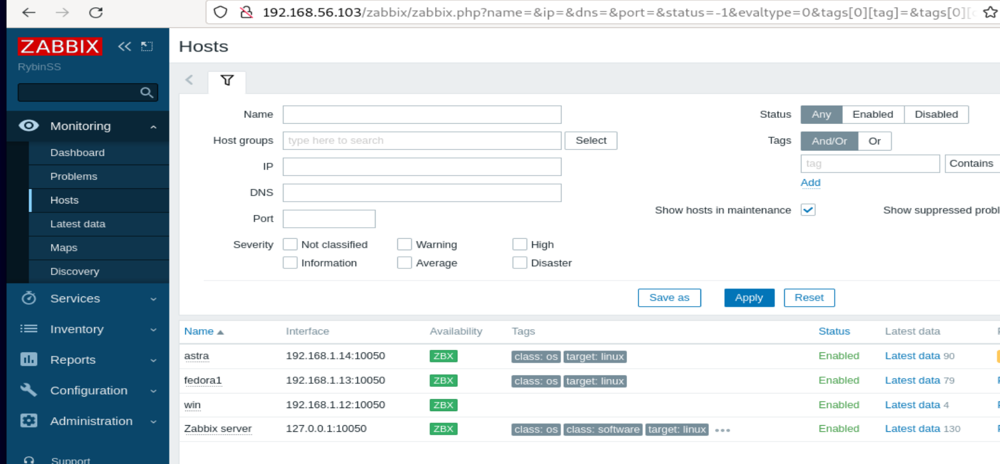
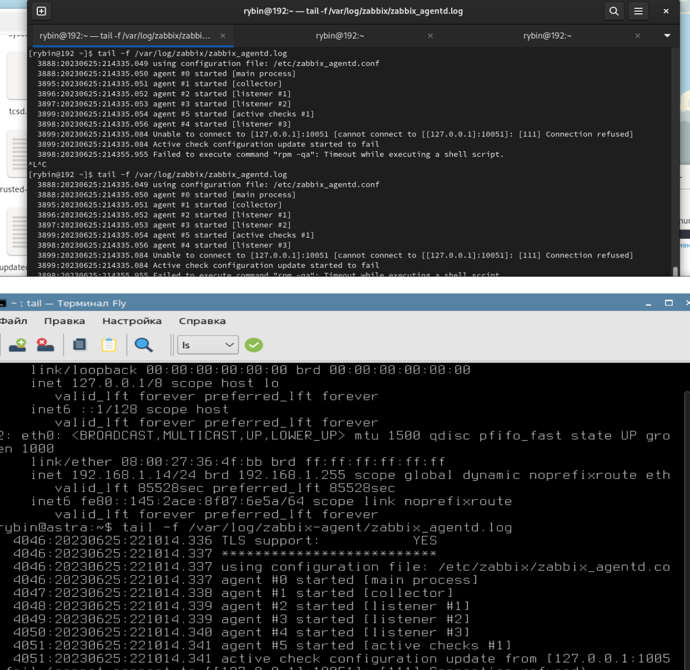
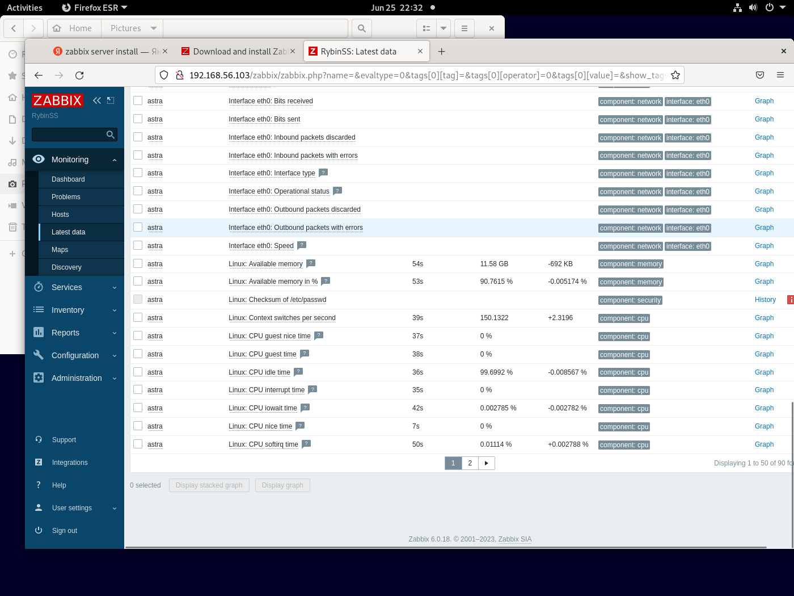
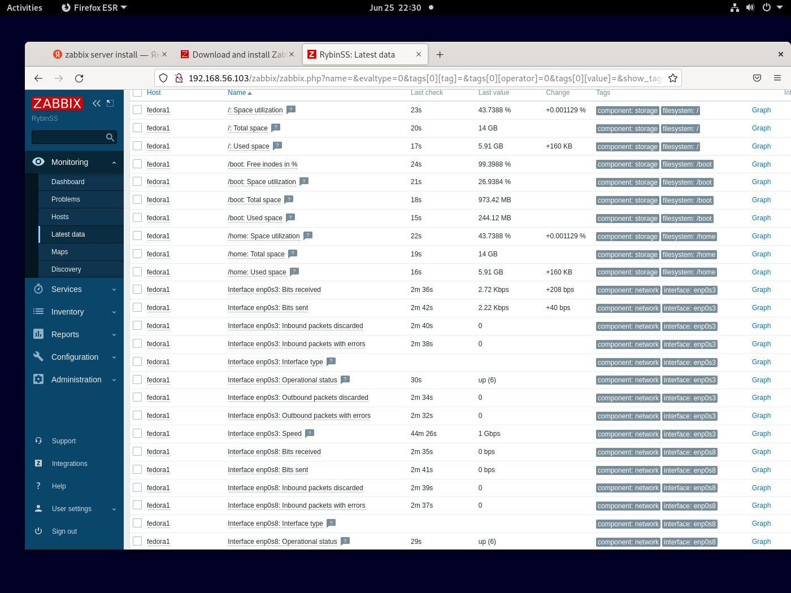
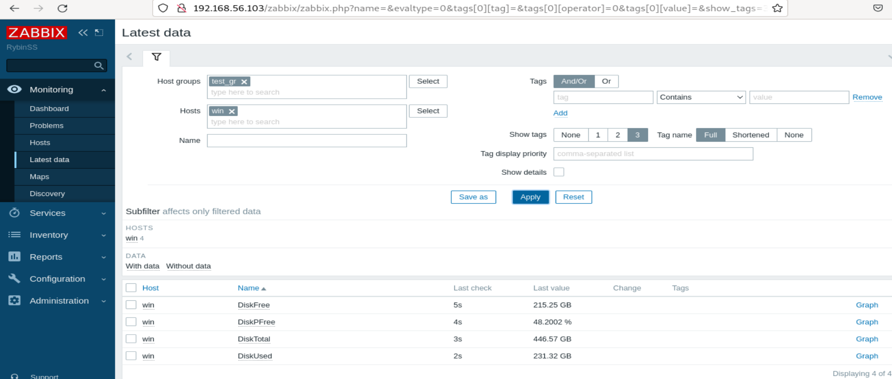

# mon_hw_8.04_zabbix
### Задание 1

`Установите Zabbix Server с веб-интерфейсом`

1. `Выполняя ДЗ сверяйтесь с процессом отражённым в записи лекции.`
2. `Установите PostgreSQL. Для установки достаточна та версия что есть в системном репозитороии Debian 11`
3. `Пользуясь конфигуратором комманд с официального сайта, составьте набор команд для установки последней версии Zabbix с поддержкой PostgreSQL и Apache`
4. `Выполните все необходимые команды для установки Zabbix Server и Zabbix Web Server`

`Требования к результату`

1. `Прикрепите в файл README.md скриншот авторизации в админке`
  

2. `Приложите в файл README.md текст использованных команд в GitHub`  

apt install postgresql  
wget https://repo.zabbix.com/zabbix/6.0/debian/pool/main/z/zabbix-release/zabbix-release_6.0-4+debian11_all.deb  
dpkg -i zabbix-release_6.0-4+debian11_all.deb  
apt update  
apt install zabbix-server-pgsql zabbix-frontend-php php7.4-pgsql zabbix-apache-conf zabbix-sql-scripts  
sudo -u postgres createuser --pwprompt zabbix  
sudo -u postgres createdb -O zabbix zabbix  
zcat /usr/share/zabbix-sql-scripts/postgresql/server.sql.gz | sudo -u zabbix psql zabbix  
nano /etc/zabbix/zabbix_server.conf  
systemctl restart zabbix-server apache2  
systemctl enable zabbix-server apache2  

```
```


### Задание 2

`Установите Zabbix Agent на два хоста`

1. `Выполняя ДЗ сверяйтесь с процессом отражённым в записи лекции`
2. `Установите Zabbix Agent на 2 виртмашины, одной из них может быть ваш Zabbix Server`
3. `Добавьте Zabbix Server в список разрешенных серверов ваших Zabbix Agentов`
4. `Добавьте Zabbix Agentов в раздел Configuration > Hosts вашего Zabbix Servera`
5. `Проверьте что в разделе Latest Data начали появляться данные с добавленных агентов`

`Требования к результату`

1. `Приложите в файл README.md скриншот раздела Configuration > Hosts, где видно, что агенты подключены к серверу`

  

2. `Приложите в файл README.md скриншот лога zabbix agent, где видно, что он работает с сервером`

  

3. `Приложите в файл README.md скриншот раздела Monitoring > Latest data для обоих хостов, где видны поступающие от агентов данные.`

  
  

4. `Приложите в файл README.md текст использованных команд в GitHub`

`fedora`  

rpm -Uvh https://repo.zabbix.com/zabbix/6.4/rhel/8/x86_64/zabbix-release-6.4-1.el8.noarch.rpm  
dnf clean all  

dnf install zabbix-agent  
редактируем строку Server= в файле zabbix_agantd.conf  
sudo systemctl restart zabbix-agent  
sudo systemctl enable zabbix-agent  

`astra`

sudo apt install zabbix-agent  
редактируем строку Server= в файле zabbix_agantd.conf  
systemctl restart zabbix-agent  


### Задание 3

`Установите Zabbix Agent на Windows (компьютер) и подключите его к серверу Zabbix.`

1. `Приложите в файл README.md скриншот раздела Latest Data, где видно свободное место на диске C:`

  
для получения данных о диске:  
Создадим группы шаблонов. Назовем гупппу как :  Templates/Check-Disks-Windows  
Далее создадим шаблон. Назовем шаблон как: Check-Disks-Windows  

1) C помощью Заббикса будем собирать 4 параметра диска C:  
 1.1 Общий размер диска  
 1.2 Размер занятого места  
 1.3 Размер свободного места  
 1.4 Процент свободного места  

2) Создадим 4 элемента данных (item):  
 2.1 Свободное место на диске -             имя: DiskFree           ключ:  vfs.fs.size["c:",free]  
 2.2 Cвободное место на диске в процентах - имя: DiskPFree          ключ:  vfs.fs.size["c:",pfree]   (тут надо выбрать у Type of information: Numeric(float) и Units установить как : %)  
 2.3 Общий объём диска:                     имя: DiskTotal          ключ:  vfs.fs.size["c:",total]  
 2.4 Использующий объём диска:              имя: DiskUsed           ключ:  vfs.fs.size["c:",used]  
```
